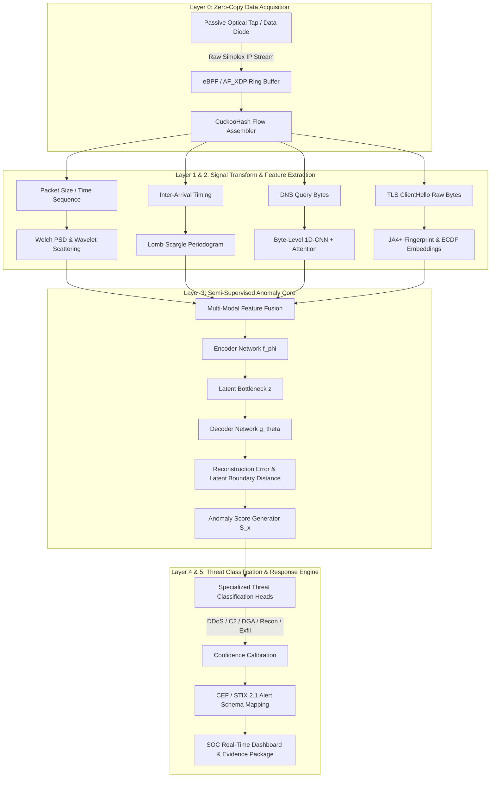

# CHRONOS: AI-Powered Passive Threat Detection Pipeline
### Smart India Hackathon 2026 — Problem Statement ID: 26145
**Title:** AI-Based Detection of Cyber Threats in Unidirectional IP Traffic  
**Theme:** Blockchain & Cybersecurity | **Category:** Software  
**Team Name:** CYBER FREAKS  

```text
  ██████╗██╗  ██╗██████╗ ███╗   ██╗██████╗ ███████╗
 ██╔════╝██║  ██║██╔══██╗████╗  ██║██╔══██╗██╔════╝
 ██║     ███████║██████╔╝██╔██╗ ██║██║  ██║███████╗
 ██║     ██╔══██║██╔══██╗██║╚██╗██║██║  ██║╚════██║
 ╚██████╗██║  ██║██║  ██║██║ ╚████║██████╔╝███████║
  ╚═════╝╚═╝  ╚═╝╚═╝  ╚═╝╚═╝  ╚═══╝╚═════╝ ╚══════╝

   A I - P O W E R E D   P A S S I V E   T H R E A T   D E T E C T I O N   P I P E L I N E
           FOR UNIDIRECTIONAL IP TRAFFIC & AIR-GAPPED NETWORKS
       Smart India Hackathon 2026 | PS ID: 26145 | Team: CYBER FREAKS
```

[](https://sih.gov.in)
[](https://sih.gov.in)
[](https://www.python.org/)
[](https://pytorch.org/)
[](https://ebpf.io/)
[](LICENSE)

---

## 📌 Executive Summary

**CHRONOS** is a high-speed, non-intrusive, read-only AI/ML cybersecurity threat detection pipeline specifically designed for **unidirectional (simplex) IP traffic streams** and **air-gapped critical infrastructure**. 

In high-security operational technology (OT), industrial control systems (ICS), defense, and satellite ground stations, **hardware data diodes** enforce strict one-way physical isolation. Traditional intrusion detection systems (IDS) rely on active probing, two-way TCP handshake tracking, stateful reassembly, or deep packet payload decryption — all of which fail in a unidirectional environment where **no return communication (ACK / feedback) is possible**.

**CHRONOS** converts a passive, one-way network mirror into an intelligent cybersecurity sensor. By extracting non-payload behavioral features (timing jitter, spectral distributions, flow entropy, and encrypted metadata fingerprints), CHRONOS detects advanced zero-day threats, covert channels, command-and-control (C2) beacons, and exfiltration attempts **without requiring network access, payload decryption, or return packets**.

---

## 🔬 Mathematical Formulation & Anomaly Core

The core of CHRONOS utilizes a **Dual-Model Semi-Supervised Baseline Manifold Learning** engine. It optimizes a **Regularized Autoencoder Objective** over unlabelled, verified benign simplex telemetry $\mathcal{D}_{\text{benign}}$ to establish a normal operational envelope:

$$\mathcal{L}_{\text{Semi}} = \sum_{i=1}^{n} \left\| \mathbf{x}_i - g_\theta(f_\phi(\mathbf{x}_i)) \right\|_2^2 + \lambda \cdot \sum_l \|\mathbf{W}_l\|_F^2$$

$$\text{Anomaly Decision Metric: } \quad \mathcal{S}(\mathbf{x}) = \|\mathbf{x} - \hat{\mathbf{x}}\|_2^2 + \beta \cdot \text{dist}(f_\phi(\mathbf{x}), \mathbf{c}) > \tau_{\text{thresh}}$$

### Core Components:
* **Encoder $f_\phi(\mathbf{x}_i)$:** Compresses high-dimensional simplex feature vectors into a lower-dimensional latent bottleneck representation $\mathbf{z}_i$.
* **Decoder $g_\theta(\mathbf{z}_i)$:** Reconstructs the expected benign traffic manifold $\hat{\mathbf{x}}_i$.
* **Frobenius Regularization Term ($\lambda \sum_l \|\mathbf{W}_l\|_F^2$):** Prevents overfitting to transient network noise while preserving compression fidelity.
* **One-Class Boundary / Latent Center ($\mathbf{c}$):** Computes the Euclidean distance of latent embeddings from the benign center of gravity.
* **Dynamic Anomaly Threshold ($\tau_{\text{thresh}}$):** Calibrated using extreme value theory (EVT). Any uncharacteristic flow (covert exfiltration burst, randomized C2 beaconing, DGA tunneling) causes reconstruction loss and latent distance to spike past $\tau_{\text{thresh}}$.

---

## 🏗️ Multi-Layer Technical Architecture



### Layer Breakdown:
* **Layer 0: Ingestion (Zero-Copy Data Acquisition):** Direct kernel bypass using DPDK / AF_XDP ring buffers and CuckooHash flow tracking for line-rate 10–100 Gbps passive processing without OS context-switch overhead.
* **Layer 1 & 2: Signal Transform & Spectral Feature Extraction:**
  * **Welch PSD & Wavelet Scattering (WST):** Deformation-stable multi-scale feature extraction for volumetric burst dynamic tracking.
  * **Lomb-Scargle Periodogram:** Spectral analysis for unevenly sampled time series to resolve randomized timing jitter ($T = T_0 \pm \delta$) in C2 beacons.
  * **JA4+ Fingerprinting:** TLS 1.3 ClientHello multi-attribute hashing (ciphers, extensions, ALPN).
  * **Byte-Level 1D-CNN Attention:** Captures domain query character distributions for DNS tunneling detection.
* **Layer 3: Semi-Supervised Anomaly Learning Core:** Fuses multi-modal feature vectors and scores deviations from learned benign behavior.
* **Layer 4: Threat Classification Engine:** Specialized multi-task heads for DDoS, Command & Control (C2), DGA, Malware, Reconnaissance, and Asymmetric Data Exfiltration.
* **Layer 5: Alert & Response Engine:** Calibrates confidence scores, constructs STIX/CEF compliant evidence packages, and streams real-time telemetry to the SOC dashboard.

---

## 💻 Repository Structure (Target Roadmap)

```bash
CHRONOS/
├── README.md               # System specification and documentation (this file)
├── requirements.txt        # Core Python and C++ binding dependencies
├── docs/                   # System architecture specs, slide decks, and diagrams
│   └── architecture.png    # Technical pipeline layout diagram
├── simulation/             # Virtual data diode & synthetic simplex traffic generator
│   ├── diode_tap.py        # Simulates one-way packet dropping / optical tap behavior
│   ├── attacks/            # Synthetic attack traffic generators
│   │   ├── c2_beacon.py    # Randomized jitter C2 beaconing simulator
│   │   ├── dga_tunnel.py   # Base64/DNS covert tunneling generator
│   │   └── exfil_burst.py  # Asymmetric data exfiltration burst simulator
│   └── benign/             # Baseline benign traffic generators (telemetry, regular syncs)
│       ├── telemetry.py    # Industrial SCADA/PLC telemetry simulator
│       └── web_sync.py     # Unidirectional NTP / HTTP sync traffic simulator
├── features/               # High-speed feature extraction pipeline
│   ├── temporal_iat.py     # Inter-arrival time calculations and sliding windows
│   ├── spectral.py         # Welch PSD and Lomb-Scargle periodogram analysis
│   ├── entropy.py          # Sliding-window Shannon entropy calculations
│   └── ja4_fingerprint.py  # TLS 1.3 ClientHello metadata extraction
├── models/                 # Semi-supervised model definitions and checkpoints
│   ├── autoencoder.py      # PyTorch Deep Autoencoder architecture
│   ├── svdd_boundary.py    # One-Class / SVDD latent boundary calculator
│   ├── temporal_fusion.py  # Transformer attention fusion layer
│   └── export_onnx.py      # Script to quantize and compile models for fast inference
└── dashboard/              # Streamlit / Web-based visualization console
    └── app.py              # Visual interface showing live anomaly scores & attack flags
```

---

## 📚 Academic & Theoretical Foundations

CHRONOS is backed by peer-reviewed research across signal processing, spectral analysis, random matrix theory, and non-linear dynamics:

| Threat Category & Method | Citation & Publication Venue | Engineering Rationale & Problem Solved | Reference Link / DOI |
| :--- | :--- | :--- | :--- |
| **1. C2 Beaconing Detection**<br>`Lomb-Scargle Periodogram` | **VanderPlas, J. T. (2018)**<br>*The Astrophysical Journal Supp.* | Least-squares spectral estimation for uneven time series; resolves randomized timing jitter ($T = T_0 \pm \delta$) in APT C2 beacons where standard FFT fails. | [10.3847/1538-4365/aab766](https://doi.org/10.3847/1538-4365/aab766) |
| **2. Volumetric DDoS**<br>`Wavelet Scattering (WST)` | **Bruna, J. & Mallat, S. (2013)**<br>*IEEE Trans. PAMI* | Multi-scale cascaded wavelet modulus convolutions; extracts translation-invariant, deformation-stable burst dynamics from packet streams. | [10.1109/TPAMI.2012.230](https://doi.org/10.1109/TPAMI.2012.230) |
| **3. Botnet & Reconnaissance**<br>`RMT & BBP Transition` | **Baik, Ben Arous, & Péché (2005)**<br>*Annals of Probability* | Tracks cross-flow correlation matrix eigenvalue excursions beyond Marchenko-Pastur noise; enables 100% unsupervised botnet sweep detection. | [10.1214/009117905000000233](https://doi.org/10.1214/009117905000000233) |
| **4. Encrypted Topology**<br>`Takens' Delay Embedding` | **Takens, F. (1981)**<br>*Dynamical Systems & Turbulence* | Reconstructs geometric phase-space manifolds and computes Betti numbers ($\beta_0, \beta_1$) from packet timing to bypass TLS 1.3/QUIC encryption. | [10.1007/BFb0091924](https://doi.org/10.1007/BFb0091924) |
| **5. Asymmetric Exfiltration**<br>`Directed Transfer Entropy` | **Schreiber, T. (2000)**<br>*Physical Review Letters* | Measures directional causality and information flow across micro-bursts to detect covert data exfiltration without reverse-path TCP ACK tracking. | [10.1103/PhysRevLett.85.461](https://doi.org/10.1103/PhysRevLett.85.461) |
| **6. Continuous-Time AI**<br>`Neural Jump-ODEs` | **Herrera, Krach, & Teichmann (2021)**<br>*ICLR Conference* | Continuous latent trajectory modeling with discrete stochastic jumps on packet arrival; eliminates 5-min batch windows for bounded sub-ms latency. | [arXiv:2006.04727](https://arxiv.org/abs/2006.04727) |
| **7. DGA & DNS Tunneling**<br>`Byte-Level Perplexity` | **Radford et al. (2019) / Tranco (2019)**<br>*OpenAI / NDSS Symposium* | Calculates character sequence surprisal trained on Tranco Top-1M; isolates dictionary-based DGAs & base64 tunneling without flagging CDNs. | [tranco-list.eu](https://tranco-list.eu/) |
| **8. Wire-Speed Ingestion**<br>`eBPF / AF_XDP Kernel Bypass` | **Høiland-Jørgensen et al. (2018)**<br>*ACM CoNEXT Conference* | Zero-copy UMEM userspace ring buffer ingestion; processes 10–100 Gbps line-rate traffic on passive optical taps without OS overhead. | [10.1145/3281411.3281443](https://doi.org/10.1145/3281411.3281443) |
| **9. TLS 1.3 Profiling**<br>`JA4+ Fingerprinting` | **FoxIO / John Althouse (2023)**<br>*FoxIO Open Security Standard* | TLS 1.3 ClientHello multi-attribute hashing (ciphers, extensions, ALPN); replaces obsolete JA3 fingerprints that collapse on TLS 1.3. | [github.com/FoxIO-LLC/ja4](https://github.com/FoxIO-LLC/ja4) |

---

## ⚡ Quickstart & Setup Guide

### 1. Prerequisites
Ensure Python 3.10+ and C++ build tools are installed on your Linux system:
```bash
sudo apt-get update
sudo apt-get install -y python3-pip python3-venv build-essential libpcap-dev
```

### 2. Installation
Clone the repository and install the required dependencies:
```bash
git clone https://github.com/CYBER-FREAKS/CHRONOS.git
cd CHRONOS

python3 -m venv venv
source venv/bin/activate  # On Linux/macOS
pip install -r requirements.txt
```

### 3. Run Virtual Data Diode Traffic Simulator
Simulate passive unidirectional traffic with mixed benign SCADA flows and covert attack traffic:
```bash
# Terminal 1: Launch the simulated data diode tap
python simulation/diode_tap.py --interface lo --rate 1000
```

### 4. Train Semi-Supervised Baseline Model
Extract features from benign traffic and train the regularized autoencoder:
```bash
python models/autoencoder.py --epochs 50 --batch-size 64 --lr 1e-3
```

### 5. Launch Real-Time SOC Dashboard
Start the interactive Streamlit monitoring dashboard to inspect live anomaly metrics and threat flags:
```bash
streamlit run dashboard/app.py
```

---

## 🛡️ Impact & Security Benefits

* **Air-Gapped Infrastructure Protection:** Full visibility over one-way OT networks, satellite downlinks, and military communications.
* **Payload Encryption Agnostic:** Detects threats inside TLS 1.3, QUIC, and encrypted custom tunnels using metadata timing and spectral scattering.
* **Zero Attack Surface:** Operates strictly in passive receive mode — impossible for adversaries to detect, scan, or exploit the sensor.
* **Sub-Millisecond Detection Bounded Latency:** Uses ONNX Runtime quantization and eBPF kernel bypass for real-time wire-speed monitoring.

---

## 👥 Team CYBER FREAKS — Smart India Hackathon 2026

* **Problem Statement ID:** 26145
* **Problem Statement Title:** AI-Based Detection of Cyber Threats in Unidirectional IP Traffic
* **Theme:** Blockchain & Cybersecurity
* **Category:** Software
* **Team:** CYBER FREAKS

---
*Developed for Smart India Hackathon 2026. Designed for Mission-Critical Defense & OT Networks.*
